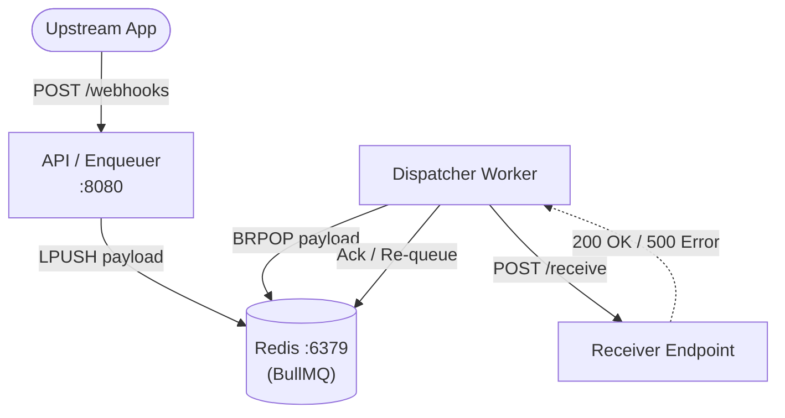

# Architecture — webhook-delivery-system
> Last updated: 2026-08-29 | Maturity: Partial Prototype
> _Durable webhook delivery via BullMQ and Redis._

## System Diagram

## Component Table
| Component | File | Responsibility | Tech |
|---|---|---|---|
| API Server | `index.js` | Receives payloads and enqueues jobs | Express.js |
| Worker | `src/worker.js` | Processes queue, handles backoff | BullMQ |
| Broker | `docker-compose.yml` | State persistence | Redis |

## Dependency Honesty Table
| Dependency | Status | Notes |
|---|---|---|
| Redis | **Real** | Used by BullMQ for durable queuing and exponential backoff tracking. |
| Receiver | **Simulated** | A dummy local endpoint is used in tests to simulate failures. |
