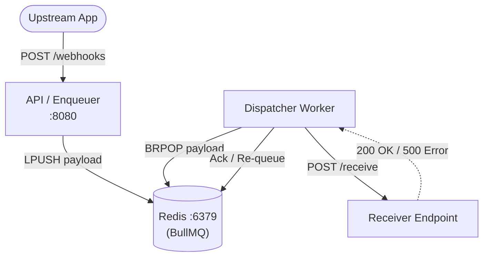
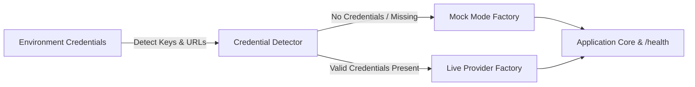

# Architecture — webhook-delivery-system
> Last updated: 2026-08-29 | Maturity: Partial Prototype
> _Durable webhook delivery via BullMQ and Redis._

## System Diagram

```mermaid
flowchart TD
    App(["Upstream App"])
    API["API / Enqueuer\n:8080"]
    Redis[("Redis :6379\n(BullMQ)")]
    Worker["Dispatcher Worker"]
    Receiver["Receiver Endpoint"]

    App -->|"POST /webhooks"| API
    API -->|"LPUSH payload"| Redis
    Worker -->|"BRPOP payload"| Redis
    Worker -->|"POST /receive"| Receiver
    Receiver -.->|"200 OK / 500 Error"| Worker
    Worker -->|"Ack / Re-queue"| Redis
```

## Component Table
| Component | File | Responsibility | Tech |
|---|---|---|---|
| API Server | `index.js` | Receives payloads and enqueues jobs | Express.js |
| Worker | `src/worker.js` | Processes queue, handles backoff | BullMQ |
| Broker | `docker-compose.yml` | State persistence | Redis |

## Dependency Honesty Table
| Dependency | Status | Notes |
|---|---|---|
| Redis | **Real** | Used by BullMQ for durable queuing and exponential backoff tracking. |
| Receiver | **Simulated** | A dummy local endpoint is used in tests to simulate failures. |

## Progressive Credential Loading & Production Architecture (v0.2.0)

This service implements the **Progressive Credential Loading (PCL)** pattern, decoupling development speed from external infrastructure provisioning:

```mermaid
graph LR
    Env[Environment Credentials] -->|Detect Keys & URLs| Detector[Credential Detector]
    Detector -->|No Credentials / Missing| Mock[Mock Mode Factory]
    Detector -->|Valid Credentials Present| Live[Live Provider Factory]
    Mock --> Runtime[Application Core & /health]
    Live --> Runtime
```

### Core Architecture Components
1. **Mode Detection Singleton:** Inspects environment configuration at boot time without hard crashes on missing secrets.
2. **Dual-Mode Factory Wrappers:**
   - **Storage / Cache:** In-process maps or SQLite `:memory:` transparently promote to managed Redis or PostgreSQL when connection strings are supplied.
   - **AI Providers:** Deterministic heuristic generators and local embeddings transparently promote to live OpenAI, Anthropic, or Gemini API clients.
3. **Hot-Reload & Dynamic TLS:** File watchers monitor mounted volume paths (Kubernetes ConfigMaps and Secrets) to update certificates and limit configs atomically without process restarts.
4. **Health & Observability:** The `/health` endpoint exposes real-time runtime mode metadata (`mock` vs `live`) across all backing adapters.
